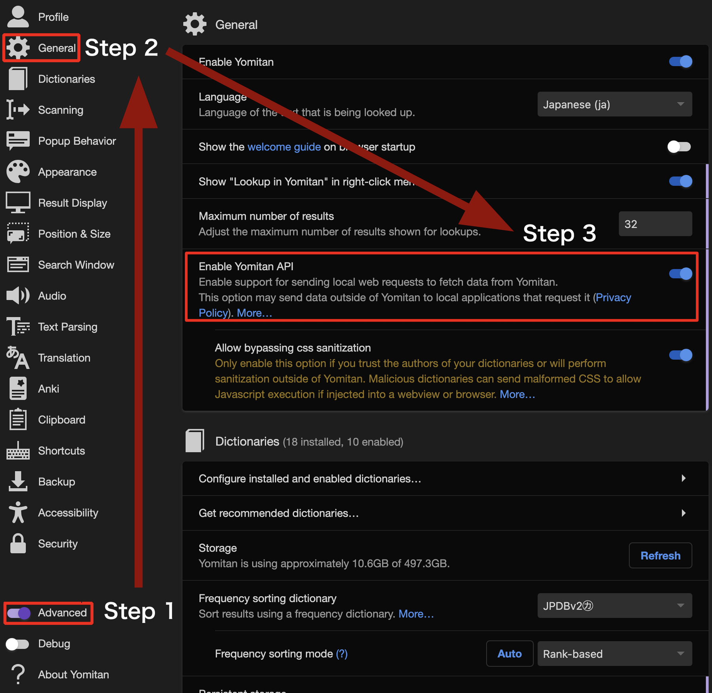
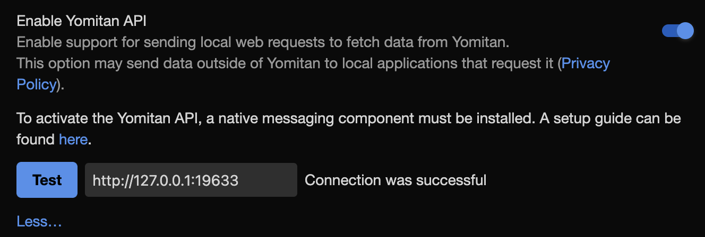

# yomitan-api-rs
An implementation of the native messaging component and it's installer for yomitan. Functions identically to [the official yomitan-api](github.com/yomidevs/yomitan-api), but removes the python dependency.

# Installation
Download an executable for your appropriate platform from [here](https://github.com/aura-ix/yomitan-api-rs/releases) for Windows and macOS users. If you are not sure which version to download on windows, you probably want the `x86_64` version. For linux users, it is suggested to build it yourself (`cargo build --release; ./target/release/installer`).

**macOS users**: Make sure to read the README.txt contained in the downloaded zip file!

Once you have downloaded the executable, run it, and go through the prompts. The vast majority of users should only have to select their browser, and then skip the manual extension ID input.

Once you have run the installer, go to the Yomitan settings page. Make sure the `Advanced` toggle in the bottom left is enabled, then go to `General` and toggle `Enable Yomitan API` on.

Finally, restart your browser, and navigate back to the Yomitan settings page, returning to `Enable Yomitan API`, then hitting `More...`, followed by the `Test` button, leaving the URL unchanged. If it states "Connection was successful", then all is well.

**If you have issues with any part of the process, please leave an issue on this repository, and not the official `yomitan` or `yomitan-api` repositories.**

# Tested platforms
- Firefox, macOS 26.2
- Firefox, Windows 11

Please open an issue or pull request if you have successfully installed it on another platform!

## TODO
- Support for custom installation parameters
- Test on all supported browsers/OS pairs
- Uninstallation